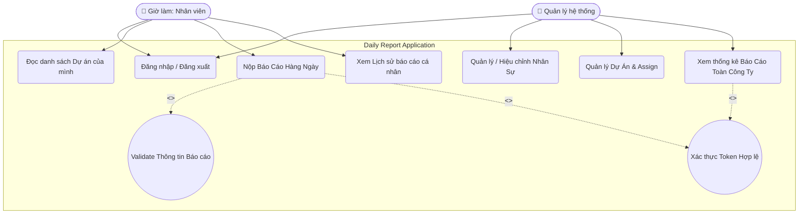
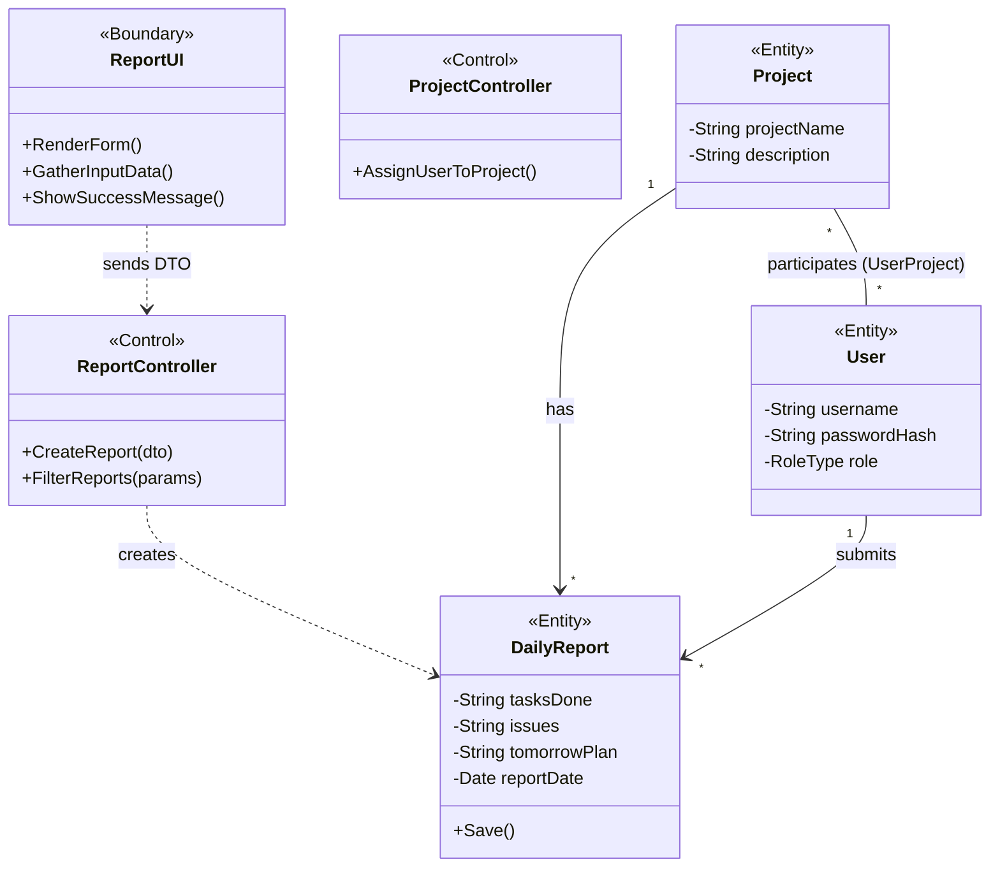
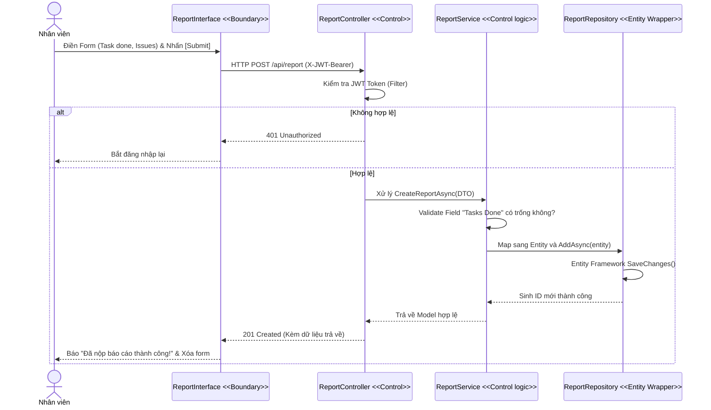
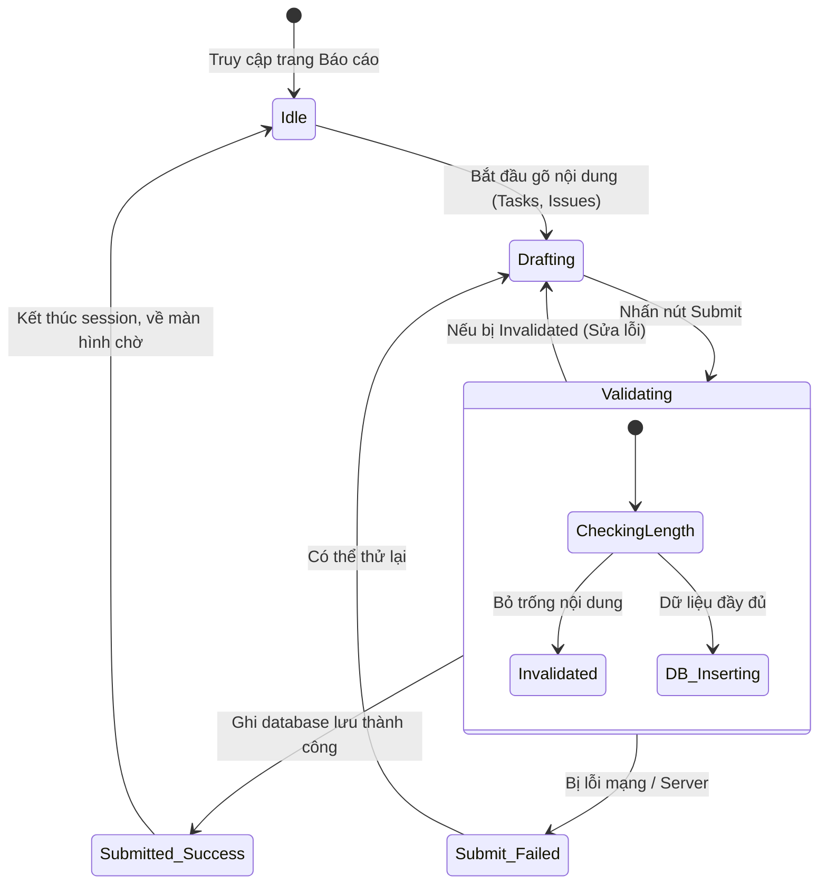

# Phân tích & Thiết kế Hệ thống Báo Cáo Công Việc (Daily Report System)
*Tài liệu phân tích thiết kế kiến trúc theo định dạng chuẩn MVC / Client-Server mô phỏng bài toán doanh nghiệp.*

---

## 1. Phân tích yêu cầu (Functional & Non-Functional)

### Functional Requirements (Yêu cầu chức năng)
Hệ thống được thiết kế hướng tới 2 nhóm người dùng (Actors) chính: **Employee (Nhân viên)** và **Admin/Manager (Quản lý)**.

*   **Employee (Nhân viên):**
    *   Đăng nhập hệ thống bảo mật bằng email và mật khẩu nội bộ.
    *   Cập nhật thông tin cá nhân (Profile).
    *   Xem danh sách các dự án (Projects) mình đang được phân công tham gia.
    *   Gửi **Daily Report** (bao gồm: Hôm nay làm gì, ngày mai làm gì, gặp khó khăn/blocker nào).
    *   Xem lịch sử báo cáo của chính mình (có chức năng phân trang, lọc theo ngày).
*   **Admin/Manager (Quản lý):**
    *   Đăng nhập hệ thống bằng quyền Admin.
    *   Quản lý danh sách Nhân viên (Tạo mới, khóa tài khoản).
    *   Quản lý Dự án (Tạo dự án mới).
    *   **Phân công (Assign):** Thêm Nhân viên vào các Dự án tương ứng.
    *   Tra cứu và xem tổng hợp toàn bộ các báo cáo của nhân viên theo Bộ lọc (Tìm theo tên dự án, tên nhân viên, hoặc khung thời gian).

### Non-Functional Requirements (Yêu cầu phi chức năng)
*   **Security (Bảo mật):** Toàn bộ API đều yêu cầu quyền truy cập hợp lệ (Xác thực thông qua `JSON Web Token - JWT`). Mật khẩu không được lưu bản rõ trên DB mà phải qua kỹ thuật Hash (Bcrypt mã hóa 1 chiều).
*   **Performance (Hiệu năng):** Khi công ty có hơn 1000 nhân viên đều nộp báo cáo lúc 17h30, hệ thống API phải sử dụng xử lý Bất đồng bộ (`async / await`) để hạn chế nghẽn kết nối, Response Time phải duy trì dưới `0.5s`.
*   **Khả năng bảo trì:** Code Back-end đi theo tư tưởng **Clean Architecture**, phân lớp (Core, Application, Infrastructure, WebApi) để dev sau này dễ thay đổi Database mà không phải đập bỏ Business Logic.
*   **Giao diện (Usability):** Ứng dụng ở tầng Client cần thiết kế Responsive, thân thiện với màn hình di động (Mobile Web) vì nhân viên hay dùng điện thoại báo cáo nhanh lúc di chuyển về.

---

## 2. Mô hình hóa chức năng (Use Case Model)

Biểu đồ sau mô tả quyền hạn của 2 Actor. Chú ý các mũi tên `<<include>>`: Một thao tác Gửi báo cáo luôn kéo theo việc Validate hệ thống một cách bắt buộc.



---

## 3. Thiết kế tĩnh (Static Modeling)

### Conceptual Static Model & Entity Class Diagram (ECB Pattern)
Dựa theo mô hình MVC / Entity-Control-Boundary, hệ thống chia lớp rõ giữa Dữ liệu, Xử lý và Hiển thị.



---

## 4. Thiết kế động (Dynamic Modeling)

### Sequence Diagram: Luồng Nộp Báo Cáo Của Nhân Viên
Làm rõ quá trình Client và Server tương tác khi nhân viên bấm "Nộp Báo Cáo".



### Statechart Diagram: Vòng đời của một Session Viết Báo Cáo
Phác họa những trạng thái của Application/Logic khi xử lý thao tác viết báo cáo.



---

## 5. Kiến trúc hệ thống (Architecture & Deployment)

### Package Diagram (Cấu trúc Thư mục phần mềm)
Thiết kế theo **Clean Architecture**, mọi gói bên ngoài phụ thuộc vào gói Core bên trong.

```mermaid
flowchart TD
    subgraph Frontend Subsystem [Nhánh Client]
        UI[React/Vue Web SPA]
        Mobile[React Native Mobile App]
    end
    
    subgraph Backend Subsystem [Nhánh Server - .NET Core]
        API_Layer[WebApi Package \n (Controllers, Middlewares)]
        App_Layer[Application Package \n (Services, DTOs)]
        Infra_Layer[Infrastructure Package \n (Repositories, EF Core)]
        Core_Layer[Core Package \n (Entities, Interfaces)]
    end

    UI --> API_Layer
    Mobile --> API_Layer
    API_Layer --> App_Layer
    Infra_Layer --> App_Layer
    App_Layer --> Core_Layer
    Infra_Layer --> Core_Layer
```

### Deployment Diagram (Thiết kế triển khai trên Internet)
Mô tả phương thức phần mềm được Public ra thành ứng dụng thực tế.

```mermaid
flowchart TD
    subgraph End Users
        PC[PC Browser]
        Phone[SmartPhone]
    end

    subgraph Cloud Infrastructure (e.g., Azure / AWS)
        WAF{"Web Application Firewall \n Mạng lưới DMZ"}
        Backend[Backend API Server \n Ubuntu + Kestrel]
        DBNode[(SQL Server Database \n Private Subnet)]
    end

    PC <-->|"HTTPS"| WAF
    Phone <-->|"HTTPS"| WAF
    WAF <-->|"Bọc Header / Chặn DDoS"| Backend
    Backend <-->|"TCP Kết nối riêng"| DBNode
```

---

## 6. Thiết kế chi tiết & Code mẫu (Design Pattern)

Hệ thống sử dụng các Design Pattern mạnh mẽ nhất của C# .NET:
1.  **Dependency Injection (DI):** Giảm thiểu sự liên kết cứng giữa Controller và Logic xử lý, Controller chỉ nhận các `Interface`.
2.  **Repository Pattern / Database Wrapper:** Mã nguồn không truy vấn cứng bằng câu lệnh SQL thẳng. Thay vào đó tạo lớp Abstract để bọc trọn gói phần CSDL (ví dụ dùng `IReportRepository`).
3.  **Data Transfer Object (DTO):** Pattern này che giấu thực thể cấu trúc CSDL hở ra mạng, bảo mật cho hệ thống.

### Hướng dẫn cách triển khai vào Source Code Template
Với quy trình trên, mẫu (Skeleton) Code mà tôi đã Build cho bạn ở các bước trước khớp hoàn toàn với thiết kế này:

**1. Lớp Interface bọc Database (Core Layer):**
```csharp
public interface IReportRepository
{
    // Bọc các hàm làm việc với DB Data
    Task<DailyReport> AddAsync(DailyReport report);
    Task<IEnumerable<DailyReport>> GetByUserIdAsync(int userId);
}
```

**2. Quản lý Trạng thái Logic Nghiệp vụ (Application Layer):**
```csharp
public class ReportService : IReportService
{
    private readonly IReportRepository _repo; // Dependency Injection

    public ReportService(IReportRepository repo) 
    {
        _repo = repo;
    }

    public async Task<DailyReport> CreateReportAsync(ReportCreateDTO dto)
    {
        // ... (Validate / Map Data) ...
        var report = new DailyReport {
            UserId = dto.UserId,
            ProjectId = dto.ProjectId,
            TasksDone = dto.TasksDone,
            ReportDate = DateTime.UtcNow
        };
        // Uỷ thác cho Wrapper lớp DB xử lý
        return await _repo.AddAsync(report);
    }
}
```

**3. Boundary / Lớp Giao tiếp Mạng ngoài (WebApi Layer):**
```csharp
[ApiController]
[Route("api/[controller]")]
public class ReportController : ControllerBase
{
    private readonly IReportService _service;
    
    public ReportController(IReportService service) { _service = service; }

    [HttpPost]
    public async Task<IActionResult> Create(ReportCreateDTO dto)
    {
        // Tiếp nhận yêu cầu từ Sequence Diagram, chuyển qua Control xử lý
        var result = await _service.CreateReportAsync(dto);
        return CreatedAtAction(nameof(Create), new { id = result.Id }, result);
    }
}
```
