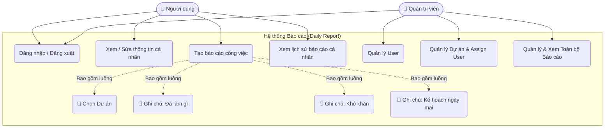
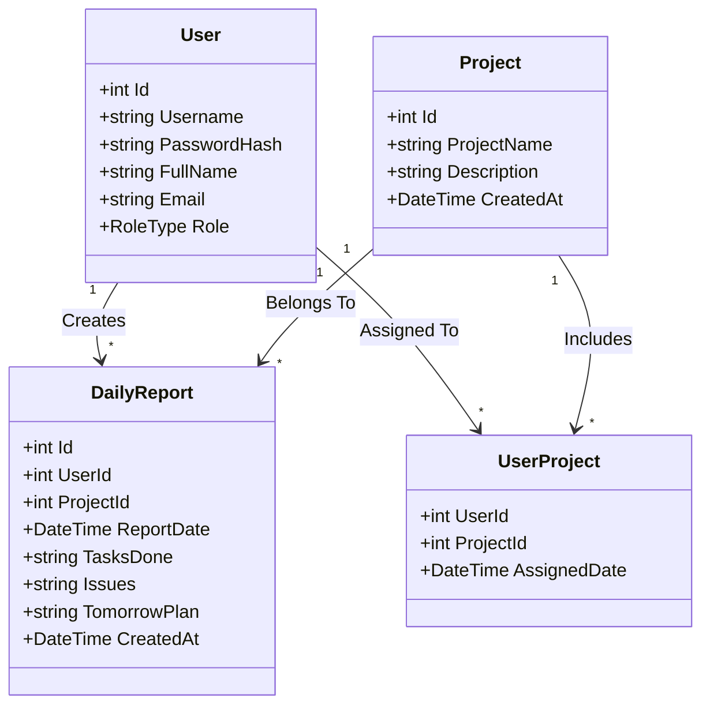
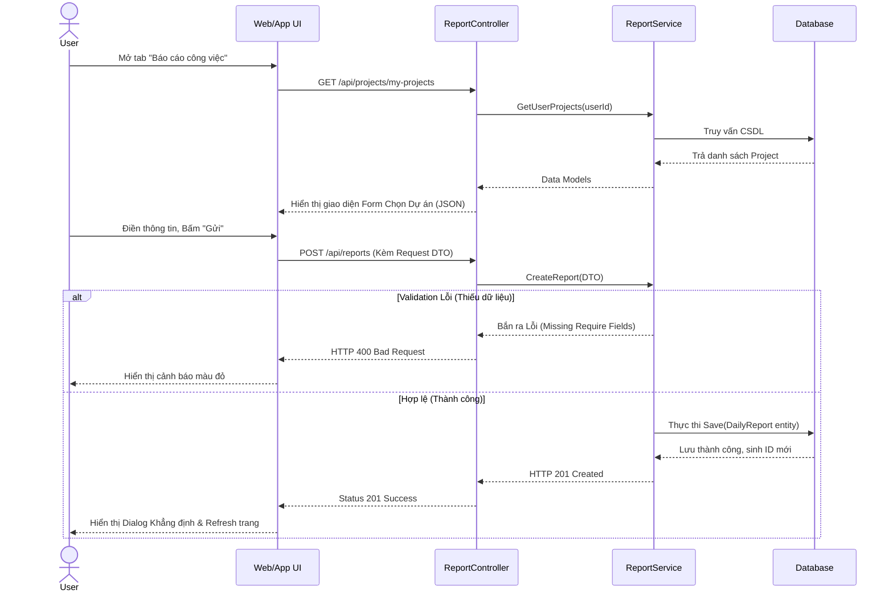
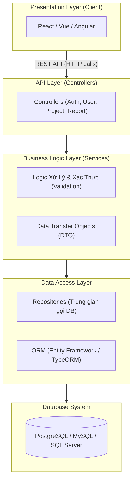
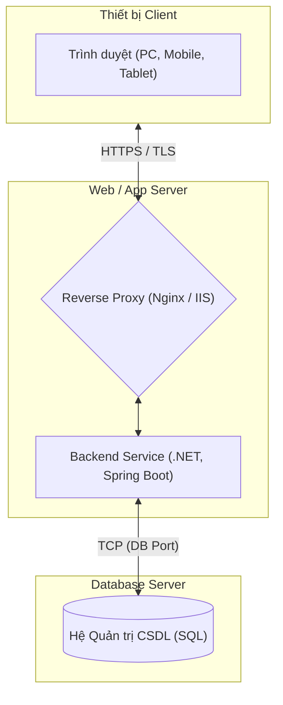

# Phân tích & Thiết kế Hệ thống Báo cáo Công việc (Daily Report System)

Dưới đây là tài liệu phân tích và thiết kế chi tiết dựa trên yêu cầu của bạn. Tôi đã cập nhật và sửa lại cấu trúc các biểu đồ Mermaid để đảm bảo hiển thị không bị lỗi.

---

## 1. Phân tích Functional Requirement (Yêu cầu chức năng)

### 1.1 Yêu cầu phía User (Người dùng thường)
*   **Đăng nhập (Login):** Người dùng sử dụng tài khoản được Admin cung cấp.
*   **Bảng điều khiển (Sidebar):**
    *   **Thông tin cá nhân:** Xem thông tin cá nhân và quản lý mật khẩu.
    *   **Báo cáo công việc:** Màn hình chính để gửi báo cáo hằng ngày.
    *   **Lịch sử báo cáo:** Màn hình phân trang liệt kê các báo cáo đã nộp, bộ lọc theo ngày và theo danh mục dự án.
    *   **Đăng xuất:** Kết thúc phiên làm việc.
*   **Quy trình báo cáo (Report Flow):**
    1.  Chọn dự án từ danh sách các dự án tham gia.
    2.  Hôm nay đã làm gì? (Today's tasks) - Textarea.
    3.  Gặp khó khăn gì? (Issues/Blockers) - Textarea.
    4.  Ngày mai sẽ làm gì? (Tomorrow's plan) - Textarea.
    5.  Nhấn Submit (Lưu dữ liệu).

### 1.2 Yêu cầu phía Admin (Quản trị viên)
*   **Quản lý Tài khoản (User):** Tạo tài khoản, khóa tài khoản nhân viên đã nghỉ, sửa thông tin.
*   **Quản lý Dự án (Project):** Tạo dự án mới, phân công (Assign) User vào dự án để họ có thể chọn khi báo cáo.
*   **Xem báo cáo hệ thống:** Xem toàn bộ các báo cáo của User trên hệ thống, lọc thông minh theo tên User, tên Dự án, hoặc theo Ngày cụ thể.

---

## 2. Phân tích Non-Functional Requirement (Yêu cầu phi chức năng)

*   **Bảo mật:** Mật khẩu Hash (bcrypt), Auth bảo mật bằng JWT Token (JSON Web Token).
*   **Hiệu suất:** Response time dưới 1s, sử dụng cơ chế kéo phân trang (Pagination) để hiển thị danh sách dài tránh làm treo trình duyệt.
*   **Tính khả dụng:** Giao diện Tương thích (Responsive) hoạt động tốt trên Desktop lẫn Mobile (để tiện lợi báo cáo lúc về).
*   **Khả năng bảo trì:** Sử dụng Clean Architecture, tách tầng rành mạch giúp dễ bảo trì lâu dài.

---

## 3. Usecase Diagram (Biểu đồ Luồng sử dụng)



---

## 4. Class Diagram (Biểu đồ Lớp dữ liệu)



---

## 5. Sequence Diagram (Luồng Gửi Báo Cáo Công Việc)



---

## 6. Package Diagram (Biểu đồ Phân Lớp Kiến Trúc)



---

## 7. Deployment Diagram (Biểu đồ Triển Khai)



---

## 8. Design Pattern Khuyến Nghị

*   **Repository Pattern:** Phân tách hoàn toàn logic làm việc với CSDL ra khỏi Service. Mọi thao tác đều làm việc qua Interface `IUserRepository`, `IReportRepository`. Tránh việc Service gọi Hardcode vào DB.
*   **Dependency Injection (DI):** Đảo ngược điều khiển, quản lý trọn vẹn và tiêm nội dung thực thi (Service, Repo) tự động vào Controller khi chạy. 
*   **DTO (Data Transfer Object):** Class chỉ chứa dữ liệu để truyền qua lại thông qua các API, không gửi phơi bày Object DB chính ra ngoài mạng internet.

---

## 9. Source Code Template (Kiến trúc C# .NET Minimal Clean Architecture) 

```text
MyApp.DailyReport/
│
├── 1. Core/                            # Tầng Trong Cùng Core
│   ├── Entities/                       # (Model Database: User, Project, DailyReport...)
│   ├── Enums/                          # (Role...)
│   └── Interfaces/                     # (IUserRepository, IReportRepository...)
│
├── 2. Application/                     # Tầng Application Group
│   ├── DTOs/                           # (ReportCreateDTO, UserResponseDTO...)
│   └── Services/                       # (ReportService, AuthService...)
│
├── 3. Infrastructure/                  # Tầng Gọi Ra Ngoài
│   ├── AppDbContext.cs                 # Lớp Entity Framework Core DB Context
│   └── Repositories/                   # Implement code gọi Insert/Update/Delete DB
│
└── 4. WebApi/                          # Tầng Nhận Request
    ├── Controllers/                    # (Auth, User, Project, Report Controller)
    ├── Middlewares/                    # Exception Middleware hứng lỗi chung
    └── Program.cs                      # Nơi đăng ký DI Container và Middleware
```
